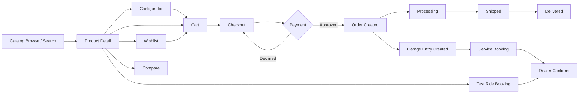
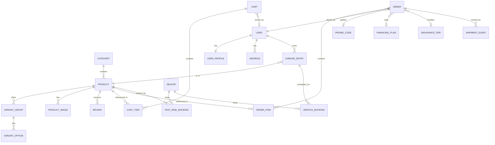
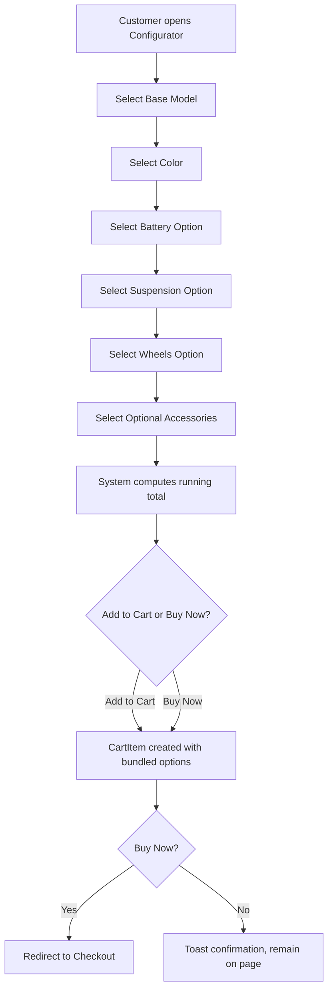
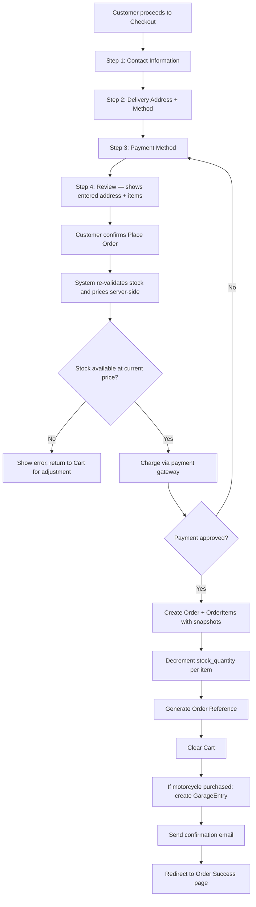
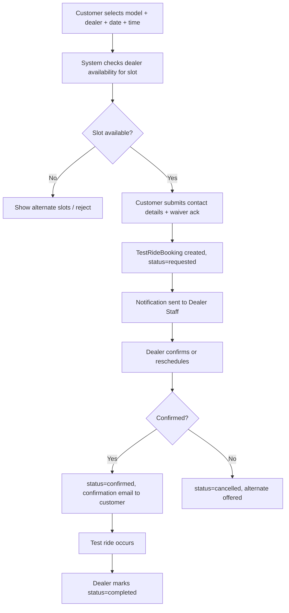
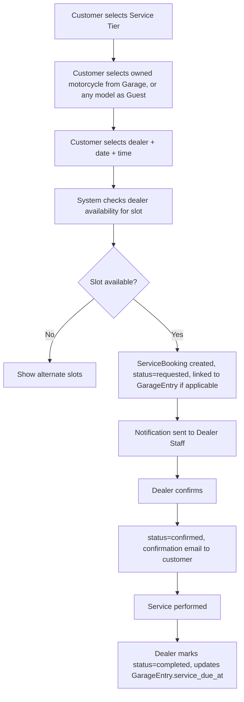

# App Requirements Documentation

## ARKO — Electric Motorcycle E-Commerce Platform

**Version:** 1.0
**Date:** September 2026
**Organization:** ARKO — Direct-to-Consumer Electric Motorcycle Manufacturer
**Document Type:** Business Requirements & System Design

---

## 1. Executive Summary

This document specifies a web-based, direct-to-consumer E-Commerce Platform for ARKO, an electric motorcycle manufacturer selling motorcycles and riding accessories online. The system replaces a static, backend-less frontend prototype with a real, data-backed platform covering the complete customer lifecycle: catalog browsing → configuration → cart → checkout → order fulfillment → post-purchase ownership (garage, service, support). It also covers the supporting commercial functions a motorcycle brand needs: dealer network management, test-ride and service scheduling, and informational financing/insurance programs.

**Key Features:**

- Product catalog and category management (motorcycles + accessories, variants, pricing, stock)
- Guided motorcycle configurator with live pricing
- Cart, wishlist, and compare, persisted per-account (not just per-browser)
- Full checkout with real address capture, shipping, VAT, and promo-code handling
- Order management with accurate status and shipment tracking tied to real purchases
- Dealer directory, test-ride booking, and service-appointment booking with dealer-side visibility
- Customer account: profile, garage (owned motorcycles), addresses, preferences, order history
- Financing and insurance program information, selectable at checkout
- FAQ/support content and contact routing
- Role-based access (Customer, Dealer Staff, Store Administrator)

---

## 2. Business Context

### 2.1 Core Commerce Lifecycle

### 2.2 Operational Context

- **Primary Use Case:** Direct-to-consumer online sales of electric motorcycles and accessories, plus supporting ownership services
- **Catalog Volume:** ~10–50 motorcycles, ~50–300 accessories (current build: 11 motorcycles, 12 accessories)
- **Order Volume:** Low hundreds to low thousands of orders per month at current scale
- **Dealer Network:** 5–20 physical dealer locations across multiple countries
- **Currency:** EUR (multi-currency is a future enhancement)
- **Language:** Multi-language storefront (interface language selectable; English primary)
- **Tax:** VAT, rate dependent on shipping destination within the EU

---

## 3. Business Objectives

1. **Replace simulated checkout with real commerce** — accurate pricing, tax, shipping, and payment, resulting in an order record that reflects exactly what was purchased
2. **Give every customer a persistent identity** — cart, wishlist, orders, and garage that follow the customer across devices once signed in
3. **Make ownership services operational** — test-ride and service bookings that a dealer can actually see, confirm, and manage
4. **Connect financing and insurance to the transaction** — not just informational pages, but selectable options that affect the order
5. **Support catalog growth without a code deployment** — administrators can add/edit motorcycles, accessories, dealers, and FAQ content directly
6. **Preserve full order traceability** — every order permanently records what was bought, at what price, with what options, shipped where
7. **Enforce accountability** — every booking, order, and content change is tied to an authenticated identity and timestamp

---

## 4. Scope

### In Scope

- **Catalog Module:** Motorcycles, accessories, categories, variants/upgrades, colors, sizes, pricing, stock quantity, media
- **Discovery Module:** Filtering, sorting, search, compare, wishlist, recently viewed, quick view
- **Configurator Module:** Guided build flow producing a priced, cart-ready configuration
- **Cart & Checkout Module:** Account-linked cart, multi-step checkout, shipping rules, VAT, promo codes
- **Order Module:** Order creation, status lifecycle, shipment tracking, order history
- **Account Module:** Profile, garage, addresses, preferences, authentication
- **Dealer & Booking Module:** Dealer directory, test-ride booking, service booking, dealer-side booking queue
- **Programs Module:** Financing plans and insurance tiers, selectable at checkout
- **Content & Support Module:** FAQ, Stories/journal, contact routing, static legal pages
- **Admin Module:** Catalog, dealer, order, and content management; role-based permissions

### Out of Scope

- Manufacturing, supply chain, or warehouse/inventory-receiving systems
- Full accounting/ERP integration (ledgers, invoicing beyond order receipts)
- Point-of-sale (in-dealer) transactions
- Native mobile apps (web-responsive only)
- Multi-currency and multi-region tax engines beyond EU VAT
- Real credit underwriting or insurance underwriting engines (financing/insurance integrate with a third-party provider at the API boundary; this system captures the request, not the credit decision)
- Live chat support

---

## 5. Assumptions

1. Every price the customer is shown is computed server-side at time of display and re-validated at time of order placement — never trusted from client input
2. A cart line item's identity is the combination of product + exact selected options (color, size, upgrades); identical selections merge, differing selections create separate lines
3. An order permanently snapshots product ID, name, unit price, and selected options at time of purchase — later catalog changes never alter historical orders
4. A customer may check out as a guest; only registered customers get persistent cross-device cart, wishlist, garage, and order history
5. Products are deactivated, never deleted, to preserve historical order integrity
6. Order references are system-assigned, sequential, and immutable
7. VAT is calculated on the subtotal based on the shipping destination and is always added to, never subtracted from, the order total
8. Test-ride and service bookings are scoped to a specific dealer, date, and time slot, and are subject to that dealer's availability
9. A promo code, once applied to a cart, remains applied through checkout and is recorded on the resulting order
10. Stock quantity decrements on order placement and is restored on cancellation; a product cannot be ordered past available stock without administrator override

---

## 6. Constraints

- **Catalog Size:** Up to 500 active products (motorcycles + accessories combined)
- **Dealers:** Up to 50 active dealer records
- **Order History:** Retained indefinitely; never purged
- **Session Security:** Guest checkout allowed; registered-account actions (garage, saved addresses, order history) require authentication; sessions expire after inactivity
- **Deployment:** Cloud-hosted web application, responsive design (desktop + mobile browsers)
- **Payment:** Integrates with a single third-party payment gateway at launch (provider-agnostic at the specification level)

---

## 7. Stakeholders

| Role | Responsibility | Count |
|---|---|---|
| **Customer (Guest)** | Browse, configure, compare, purchase without an account | Majority of traffic |
| **Customer (Registered)** | All guest capabilities, plus persistent cart/wishlist/garage, order history, saved addresses, booking history | Growing base |
| **Dealer Staff** | View and manage test-ride and service bookings for their own dealer location; update booking status | 1+ per dealer |
| **Store Administrator** | Catalog management, order management, dealer directory, content (FAQ/Stories) management, user/role management, full reporting | 1–5 |

---

## 8. Glossary

| Term | Definition |
|---|---|
| **Product** | A catalog item — either a Motorcycle or an Accessory |
| **Variant Group** | A named set of configurable options for a motorcycle (Battery, Suspension, Wheels) |
| **Upgrade** | A priced option within a variant group that adds to a product's base price |
| **Cart Line Item** | One entry in a cart, uniquely identified by product + exact selected options |
| **Configurator** | The guided build flow that produces a fully specified, priced motorcycle configuration |
| **Compare** | Side-by-side specification comparison, limited to motorcycles |
| **Wishlist** | A saved list of products a customer intends to revisit or purchase later |
| **Order** | A confirmed purchase, immutable once placed except for status/tracking updates |
| **Order Reference** | System-assigned unique identifier for an order (e.g., `ARK-2026-0847`) |
| **Garage** | The set of motorcycles associated with a customer's account (owned via purchase or manually added) |
| **Dealer** | A physical ARKO retail/service location |
| **Test Ride Booking** | A scheduled appointment to test-ride a model at a specific dealer |
| **Service Booking** | A scheduled maintenance appointment for an owned motorcycle at a specific dealer |
| **Service Tier** | One of the fixed-price maintenance packages (Routine Check, Battery Service, Major Service) |
| **Promo Code** | A code applied at cart or checkout that discounts the order subtotal |
| **VAT** | Value-Added Tax, calculated on subtotal based on shipping destination |
| **Stock Quantity** | The number of units of a product currently available to sell |
| **Availability Status** | Derived state of a product: In Stock, Low Stock, Out of Stock, or Pre-Order |
| **Financing Plan** | A term-based, informational payment-plan option a customer can select at checkout |
| **Insurance Tier** | A protection-plan option a customer can select and bundle at checkout |

---

## 9. User Roles & Permissions

### 9.1 Role Hierarchy

```mermaid
graph TD
    A[Store Administrator] --> B[Full System Access]
    C[Dealer Staff] --> D[Own-Dealer Booking Management]
    E[Registered Customer] --> F[Own Account + Commerce]
    G[Guest Customer] --> H[Anonymous Browsing + Commerce]

    B --> I[Catalog Management]
    B --> J[Order Management]
    B --> K[Dealer Directory Management]
    B --> L[Content Management]
    B --> M[User & Role Management]
    B --> N[Full Reporting]

    D --> O[View Bookings for Own Dealer]
    D --> P[Confirm / Reschedule / Complete Bookings]

    F --> Q[Persistent Cart / Wishlist / Compare]
    F --> R[Garage, Addresses, Preferences]
    F --> S[Order History]
    F --> T[Book Test Ride / Service]

    H --> U[Cart / Wishlist — Session Only]
    H --> V[Guest Checkout]
    H --> W[Book Test Ride / Service — Contact Details Required]
```

### 9.2 Permission Matrix

| Action | Store Admin | Dealer Staff | Registered Customer | Guest |
|---|:---:|:---:|:---:|:---:|
| Browse catalog, search, compare | ✅ | ✅ | ✅ | ✅ |
| Add/edit/deactivate products | ✅ | ❌ | ❌ | ❌ |
| Manage categories, variants, stock | ✅ | ❌ | ❌ | ❌ |
| Manage dealer directory | ✅ | ❌ | ❌ | ❌ |
| Manage FAQ / Stories content | ✅ | ❌ | ❌ | ❌ |
| Manage user accounts / roles | ✅ | ❌ | ❌ | ❌ |
| Add to cart / wishlist / compare | ✅ | ➖ | ✅ | ✅ (session-scoped) |
| Checkout / place order | ➖ | ➖ | ✅ | ✅ (as guest) |
| View own order history | ➖ | ➖ | ✅ | ✅ (via order reference + email) |
| View / manage all orders | ✅ | ❌ | ❌ | ❌ |
| Manage own Garage, Addresses, Preferences | ➖ | ➖ | ✅ | ❌ |
| Book test ride / service | ✅ | ➖ | ✅ | ✅ |
| View / manage bookings for own dealer | ❌ | ✅ | ❌ | ❌ |
| View / manage bookings across all dealers | ✅ | ❌ | ❌ | ❌ |
| Access sales / revenue reports | ✅ | ❌ | ❌ | ❌ |
| Export data (CSV) | ✅ | ❌ | ❌ | ❌ |

*(➖ = not a typical use case for this role, not a hard restriction)*

---

## 10. Data Models

### 10.1 Entity Overview

### 10.2 Core Models

| Model | Key Fields |
|---|---|
| **Category** | `id`, `name`, `product_type` (motorcycle/accessory), `is_active` |
| **Product** | `id`, `slug` (unique), `name`, `product_type` (motorcycle/accessory), `category` (FK), `price`, `old_price` (nullable), `description`, `features` (list), `stock_quantity`, `low_stock_threshold`, `availability_status` (computed), `badge` (nullable), `rating_cached`, `review_count_cached`, `is_active`, `created_at` |
| **ProductColor** | `id`, `product` (FK), `name`, `hex_value` |
| **ProductSize** | `id`, `product` (FK), `label` (e.g., "M", "42") — accessories only |
| **VariantGroup** | `id`, `product` (FK, motorcycles only), `name` (Battery/Suspension/Wheels) |
| **VariantOption** | `id`, `variant_group` (FK), `label`, `price_delta`, `is_default` |
| **ProductImage** | `id`, `product` (FK), `image`, `sort_order` |
| **ProductSpec** | `id`, `product` (FK), `key`, `value` (range, power, weight, top speed, battery, charge time, etc.) |
| **RelatedProduct** | `id`, `product` (FK), `related_product` (FK) — self-referencing M2M through table |
| **Review** | `id`, `product` (FK), `user` (FK nullable for guest), `author_name`, `rating`, `title`, `body`, `created_at`, `is_approved` |
| **Cart** | `id`, `user` (FK nullable — guest carts use session key), `session_key` (nullable), `created_at`, `updated_at` |
| **CartItem** | `id`, `cart` (FK), `product` (FK), `quantity`, `selected_color`, `selected_size`, `selected_upgrades` (JSON list of {variant_group, option, price_delta}) |
| **PromoCode** | `id`, `code` (unique), `discount_percent`, `valid_from`, `valid_until`, `min_order_value`, `is_active` |
| **Order** | `id`, `reference` (unique, auto-generated), `user` (FK nullable — guest orders store contact fields directly), `guest_email`, `guest_name`, `guest_phone`, `status` (processing/shipped/delivered/cancelled), `subtotal`, `shipping_cost`, `vat_amount`, `discount_amount`, `promo_code` (FK nullable), `total`, `delivery_method` (standard/express), `payment_method` (card/paypal/sepa), `financing_plan` (FK nullable), `insurance_tier` (FK nullable), `delivery_address` (FK to Address, or embedded snapshot fields), `placed_at` |
| **OrderItem** | `id`, `order` (FK), `product` (FK), `product_name_snapshot`, `unit_price_snapshot`, `quantity`, `selected_options_snapshot` (JSON) |
| **ShipmentEvent** | `id`, `order` (FK), `stage` (order_placed/manufacturing/quality_check/shipped/out_for_delivery/delivered), `carrier`, `tracking_number`, `occurred_at` (nullable if pending), `is_complete` |
| **Address** | `id`, `user` (FK), `label`, `street`, `city`, `postal_code`, `country`, `is_default` |
| **UserProfile** | `id`, `user` (OneToOne), `role` (customer/dealer_staff/admin), `dealer` (FK, dealer_staff only), `phone`, `date_of_birth`, `preferred_language`, `marketing_opt_in`, `order_notifications_opt_in`, `promo_opt_in` |
| **GarageEntry** | `id`, `user` (FK), `product` (FK), `order_item` (FK nullable — links purchase to garage), `vin`, `warranty_active`, `service_due_at` |
| **Dealer** | `id`, `name`, `city`, `country`, `address`, `phone`, `latitude`, `longitude`, `hours`, `is_active` |
| **TestRideBooking** | `id`, `product` (FK), `dealer` (FK), `date`, `time_slot`, `first_name`, `last_name`, `email`, `phone`, `license_number`, `user` (FK nullable), `status` (requested/confirmed/completed/cancelled), `created_at` |
| **ServiceBooking** | `id`, `garage_entry` (FK nullable), `product` (FK), `dealer` (FK), `service_tier` (FK), `date`, `time_slot`, `user` (FK nullable), `contact_email`, `contact_phone`, `status`, `created_at` |
| **ServiceTier** | `id`, `name` (Routine Check/Battery Service/Major Service), `price`, `description` |
| **FinancingPlan** | `id`, `term_months`, `apr`, `description`, `is_featured` |
| **InsuranceTier** | `id`, `name` (Essential/Comprehensive/Premium), `monthly_price`, `features` (JSON list), `is_featured` |
| **FAQEntry** | `id`, `category`, `question`, `answer`, `sort_order` |
| **Story** | `id`, `title`, `slug`, `body`, `cover_image`, `published_at`, `is_published` |
| **ContactMessage** | `id`, `department`, `name`, `email`, `subject`, `message`, `created_at`, `is_resolved` |

### 10.3 Computed / Derived Values

| Value | Formula |
|---|---|
| **Cart Line Total** | `(Product.price + Σ selected_upgrades.price_delta) × CartItem.quantity` |
| **Cart Subtotal** | `Σ Cart Line Total` across all cart items |
| **Shipping Cost** | `0 if Cart Subtotal > 1000 else 49` (Express Delivery adds a flat surcharge at checkout instead of replacing this rule) |
| **Discount Amount** | `Cart Subtotal × PromoCode.discount_percent` if a valid, unexpired code meeting `min_order_value` is applied |
| **VAT Amount** | `(Cart Subtotal − Discount Amount) × vat_rate(destination_country)` |
| **Order Total** | `Subtotal − Discount + Shipping + VAT` *(VAT and Shipping are added; Discount is subtracted — see BR-CHK-06)* |
| **Availability Status** | `OUT_OF_STOCK if stock_quantity = 0` / `LOW_STOCK if stock_quantity ≤ low_stock_threshold` / `PRE_ORDER if flagged pre-order` / `IN_STOCK otherwise` |
| **Average Rating** | `Σ Review.rating / count(Review)` where `is_approved = true`, falling back to `rating_cached` if no approved reviews exist |
| **Order Reference** | `ARK-{YYYY}-{NNNN}` sequential per year |

---

## 11. Business Workflows

### 11.1 Configurator → Cart Workflow

### 11.2 Checkout & Order Placement Workflow

### 11.3 Test Ride Booking Workflow

### 11.4 Service Booking Workflow

---

## 12. Key Pages / Screens

### 12.1 Homepage (All Visitors)

**Displays:** Hero, curated fleet showcase, category shortcuts, flagship spotlight, accessories teaser, test-ride CTA, testimonials, compare teaser — all sourced live from Product/Category/Review data, not hardcoded.

### 12.2 Catalog List — Shop / Accessories

**Columns/Cards:** Image, badge, category, name, rating, key specs, colors, availability, price
**Filters:** Category, price range, minimum range (motorcycles), availability, color
**Sort:** Featured, price asc/desc, rating, range
**Search:** By name, category, description across both product types

### 12.3 Product Detail Page

**Sections:** Gallery, price + availability, color/size/variant selectors, quantity, Add to Cart / Buy Now / Save, Specifications tab, Features tab, Reviews tab (average + breakdown + list + submit), Shipping & Returns tab (motorcycles), Related Products
**Behavior:** Sticky purchase bar on scroll; view recorded to Recently Viewed

### 12.4 Configurator

**Steps:** Model → Color → Battery → Suspension → Wheels → Accessories
**Displays:** Live build preview, itemized running total, per-step option pricing
**Actions:** Add to Cart, Buy Now

### 12.5 Compare

**Columns:** Up to 4 motorcycles
**Rows:** Category, Price, Range, Power, Weight, Top Speed, Battery, Charge Time, Rating, Reviews, Availability, Colors
**Behavior:** Differing values highlighted per row

### 12.6 Cart

**Columns:** Image, name, selected options, quantity stepper, remove, line total
**Summary:** Subtotal, Shipping, Promo code input + Discount, Total
**Actions:** Continue Shopping, Clear Cart, Proceed to Checkout

### 12.7 Checkout

**Steps:** Information → Delivery → Payment → Review
**Persistent Sidebar:** Subtotal, Shipping, VAT, Discount, Total — recalculated live at every step
**Review Step:** Shows the address and items actually entered in prior steps (not a fixed placeholder)

### 12.8 Order Success

**Displays:** Order reference, confirmation message, next-steps sequence, link to Order Detail

### 12.9 Account (Registered Customers)

**Tabs:** Profile, Garage, Orders (recent + link to full history), Wishlist, Preferences, Addresses, Support shortcuts
**Access:** Requires authentication; every value scoped to the signed-in user

### 12.10 Orders (List / Detail / Tracking)

**List Columns:** Reference, date, status badge, items, actions (Details/Track/Reorder by status)
**Filters:** Status
**Detail:** Full item breakdown, total, delivery address used
**Tracking:** Ordered ShipmentEvent timeline with carrier + tracking number

### 12.11 Dealers

**Columns/Cards:** Name, address, phone, hours, Test Ride action, Directions link
**Map:** Pins from Dealer.latitude/longitude
**Search:** By name, city, country

### 12.12 Test Ride / Service Booking

**Test Ride Fields:** Model, dealer, date (≥ tomorrow), time slot, contact details, licence number, waiver
**Service Fields:** Service tier, owned motorcycle (or model, guest), dealer, date, time slot, contact details
**Confirmation:** Success state replaces form; booking visible to assigned Dealer Staff

### 12.13 Dealer Staff Console (New)

**Displays:** Queue of Test Ride and Service bookings for the logged-in staff member's own dealer, filterable by status and date
**Actions:** Confirm, reschedule, mark completed, cancel

### 12.14 Financing / Insurance

**Financing:** Plan comparison (12/24/36 months), monthly-payment calculator, FAQ
**Insurance:** Tiered plan comparison (Essential/Comprehensive/Premium) with feature checklist
**Checkout Integration:** Both selectable as an `Order.financing_plan` / `Order.insurance_tier` during the Payment step

### 12.15 Support / Contact

**Support:** Searchable FAQ accordion by category, contact form
**Contact:** Department-routed contact form
**Both:** Submissions create a `ContactMessage` record routed to Store Administrators

### 12.16 Admin (Store Administrator)

**Sections:**
- Catalog management (products, categories, variants, stock, media)
- Order management (view/filter/update status, refunds)
- Dealer directory management
- Content management (FAQ, Stories)
- User & role management
- Sales and operational reports (Section 14)

---

## 13. Business Rules

### 13.1 Catalog Rules

| Rule | Description |
|---|---|
| **BR-CAT-01** | Product slug is unique, URL-safe, and immutable once any order references the product |
| **BR-CAT-02** | Products are never deleted — only deactivated (`is_active = false`) |
| **BR-CAT-03** | Deactivated products do not appear in catalog listings, search, or the Configurator, but remain resolvable for historical order display |
| **BR-CAT-04** | A motorcycle's Variant Groups (Battery, Suspension, Wheels) each require at least one option flagged `is_default` |
| **BR-CAT-05** | Only accessories may define Sizes; only motorcycles may define Variant Groups |
| **BR-CAT-06** | A product must have a name, category, price, and at least one image to be published |
| **BR-CAT-07** | `stock_quantity` cannot go negative; an order that would drive it below zero is blocked at checkout (BR-CHK-01) |

### 13.2 Cart Rules

| Rule | Description |
|---|---|
| **BR-CART-01** | A cart line item's identity is `(product_id, color, size, sorted selected_upgrades)`; matching identity increments quantity, any difference creates a new line |
| **BR-CART-02** | A guest's cart is keyed to their session; a registered customer's cart is keyed to their account and persists across devices |
| **BR-CART-03** | On login, a guest's session cart is merged into the customer's account cart (matching lines combine by quantity; distinct lines are appended) |
| **BR-CART-04** | Cart line prices are always recalculated from current catalog data on render — a cart never stores a stale computed price as truth |
| **BR-CART-05** | Quantity has a floor of 1 per line; removing a line requires the explicit remove action, not decrementing to 0 |

### 13.3 Checkout & Pricing Rules

| Rule | Description |
|---|---|
| **BR-CHK-01** | At "Place Order," the system re-validates every line's stock and current price server-side before charging; a change since the cart was built halts checkout with an explanation, it does not charge the stale price |
| **BR-CHK-02** | Shipping is free above a subtotal of €1,000, otherwise a flat €49 standard shipping fee applies; selecting Express Delivery adds a flat €49 **surcharge on top of** (not a replacement for) the standard shipping determination |
| **BR-CHK-03** | A promo code applied to the cart is stored on the cart (or session) and automatically carried into and honored at Checkout — it must never silently disappear between pages |
| **BR-CHK-04** | VAT is calculated on `(subtotal − discount)` using the rate for the selected shipping destination country |
| **BR-CHK-05** | A promo code is valid only if `is_active`, within its `valid_from`/`valid_until` window, and the cart subtotal meets `min_order_value` |
| **BR-CHK-06** | **Order Total = Subtotal − Discount + Shipping + VAT.** VAT and Shipping are always added; Discount is always subtracted. (This corrects a defect present in the prior prototype, where VAT was subtracted from the total.) |
| **BR-CHK-07** | The delivery address and contact details captured in Checkout Steps 1–2 are what the Review step (Step 4) displays and what is stored on the resulting Order — never a placeholder or unrelated value |
| **BR-CHK-08** | Selecting a Financing Plan or Insurance Tier during Payment attaches it to the Order record; it does not alter the charged total unless the plan/tier itself carries an explicit price (e.g., an insurance tier's first payment) |

### 13.4 Order & Fulfillment Rules

| Rule | Description |
|---|---|
| **BR-ORD-01** | Every OrderItem stores a snapshot of `product_id`, `product_name`, `unit_price`, and `selected_options` at time of purchase — never re-derived from the current catalog or from parsing a display name |
| **BR-ORD-02** | Orders are immutable except for `status` and their associated `ShipmentEvent` records |
| **BR-ORD-03** | Placing an order decrements `stock_quantity` on each purchased product; cancelling an order restores it |
| **BR-ORD-04** | A registered customer sees only their own orders; a guest can retrieve an order only via its reference plus the email used at purchase |
| **BR-ORD-05** | Purchasing a motorcycle automatically creates a `GarageEntry` linked to the customer's account (registered customers only) |
| **BR-ORD-06** | Order reference numbers are system-assigned, sequential per year, and immutable |

### 13.5 Booking Rules (Test Ride / Service)

| Rule | Description |
|---|---|
| **BR-BK-01** | A booking requires a specific dealer, date (≥ tomorrow), and time slot; the system checks that dealer's existing bookings for that slot before accepting a new one |
| **BR-BK-02** | Two bookings cannot occupy the same dealer + date + time slot once one is confirmed |
| **BR-BK-03** | A submitted booking starts in `requested` status and is visible immediately in the assigned dealer's booking queue |
| **BR-BK-04** | Only Dealer Staff assigned to the booking's dealer (or a Store Administrator) may confirm, reschedule, cancel, or complete a booking |
| **BR-BK-05** | Completing a Service Booking updates the related `GarageEntry.service_due_at` based on the service tier performed |
| **BR-BK-06** | A guest may submit a booking by supplying contact details directly; a registered customer's bookings are additionally linked to their account for later reference |

### 13.6 Account & Authentication Rules

| Rule | Description |
|---|---|
| **BR-ACC-01** | Account, Orders, Garage, Addresses, and Preferences pages require an authenticated session; unauthenticated access redirects to Login |
| **BR-ACC-02** | Every value rendered on these pages is scoped to the authenticated user's own data — never shared or fixed demo content |
| **BR-ACC-03** | Registration requires a unique email and a password meeting minimum strength criteria (length, uppercase, digit, special character) |
| **BR-ACC-04** | A `UserProfile.role` of `dealer_staff` must have an assigned `dealer`; such a user's booking-queue access is scoped to that dealer only |
| **BR-ACC-05** | Sessions expire after a period of inactivity; re-authentication is required to resume account-linked actions |

---

## 14. Reports & KPIs

### 14.1 Operational KPIs (Admin Dashboard)

| KPI | Formula | Audience |
|---|---|---|
| Total Revenue (period) | `Σ Order.total` where `status != cancelled`, within date range | Admin |
| Total Orders (period) | Count of orders placed within date range | Admin |
| Average Order Value | `Total Revenue / Total Orders` | Admin |
| Orders by Status | Count of orders grouped by `status` | Admin |
| Top-Selling Products | `Σ OrderItem.quantity` grouped by product, ranked descending | Admin |
| New Registered Customers (period) | Count of new `User` accounts created within date range | Admin |
| Products Low / Out of Stock | Count of products with `availability_status` in (LOW_STOCK, OUT_OF_STOCK) | Admin |
| Pending Bookings | Count of Test Ride + Service bookings with `status = requested` | Admin, Dealer Staff (own dealer) |
| Cart Abandonment Rate | `1 − (Orders Placed / Carts Created)` within a period | Admin |

### 14.2 Report Formulas

| Report | Key Calculation |
|---|---|
| Sales by Category | `Σ OrderItem (unit_price × quantity)` grouped by `Product.category` |
| Sales by Product | `Σ OrderItem (unit_price × quantity)` grouped by `Product` |
| Promo Code Usage | Count and total discount amount grouped by `PromoCode` |
| Dealer Booking Volume | Count of Test Ride + Service bookings grouped by `Dealer`, over a date range |
| Financing / Insurance Attach Rate | `Orders with financing_plan or insurance_tier set / Total Orders` |
| Review Rating Distribution | Count of approved `Review` grouped by `rating`, per product |
| Stock Valuation | `Σ (Product.stock_quantity × Product.price)` for active products |

### 14.3 Report Features

- **Export formats:** CSV
- **All reports:** filterable by date range
- **Sales reports:** filterable by category, product, dealer
- **Booking reports:** filterable by dealer, status, date

---

## 15. Edge Cases & Validations

### 15.1 Edge Cases

| Scenario | Handling |
|---|---|
| **Price or stock changes between adding to cart and placing order** | Checkout re-validates server-side (BR-CHK-01); customer is shown the change and asked to confirm before charging |
| **Two customers order the last unit of a product simultaneously** | Stock decrement is atomic; the second request fails validation and is shown an out-of-stock message before payment is charged |
| **Promo code expires between cart and checkout** | Code is re-validated at checkout; if no longer valid, the discount is removed and the customer is notified before final total is shown |
| **Guest checks out, later registers with the same email** | Guest orders are linked to the new account retroactively by matching `guest_email` to the registered email, so order history isn't lost |
| **Customer requests two bookings for the same dealer/date/time** | Second request is blocked at submission with available alternate slots shown (BR-BK-02) |
| **Order cancelled after stock was decremented** | Stock is restored on cancellation (BR-ORD-03); GarageEntry created from that order is flagged or removed per admin policy |
| **Dealer deactivated with pending bookings** | System blocks deactivation until pending bookings are reassigned or resolved |
| **Product deactivated while in an active customer's cart** | Cart line is flagged unavailable at checkout; customer must remove it to proceed |
| **Customer changes shipping destination after VAT was shown** | VAT recalculates immediately against the new destination before the total is finalized |
| **Review submitted by a customer who never purchased the product** | Allowed but flagged (`is_verified_purchase = false`) for potential moderation; not blocked outright |
| **Financing plan selected but payment method is not compatible** | System restricts financing selection to compatible payment methods only (e.g., card-based) |
| **Dealer staff attempts to view another dealer's bookings** | Blocked at the permission layer (BR-ACC-04); scoped strictly to their assigned dealer |

### 15.2 Data Validation Rules

| Field | Rule |
|---|---|
| Product slug | Required, unique, URL-safe, immutable after first order references it |
| Product price | Required; decimal ≥ 0 |
| stock_quantity | Required; integer ≥ 0 |
| CartItem quantity | Required; integer ≥ 1 |
| PromoCode.code | Required, unique, case-insensitive match |
| PromoCode.discount_percent | Required; 0 < value ≤ 100 |
| Order delivery address | Required; must reference a valid country from the supported shipping list |
| Order payment method | Required; one of card, paypal, sepa |
| TestRideBooking.date / ServiceBooking.date | Required; must be ≥ tomorrow |
| TestRideBooking.license_number | Required |
| Review.rating | Required; integer 1–5 |
| UserProfile.role = dealer_staff | Must have a non-null `dealer` assigned |
| Address.postal_code | Required; format validated per selected country |

---

## 16. Dependencies & Integrations

### 16.1 Internal Dependencies

- **Category** must exist before a Product can be assigned to it
- **Product** must be active before it can be added to Cart, Configurator, Compare, or a Booking
- **VariantGroup/VariantOption** must exist before the Configurator can present a motorcycle's build steps
- **Dealer** must be active before it can be selected in a Test Ride or Service booking
- **ServiceTier** must exist before a Service Booking can be created
- **UserProfile.role** must be assigned before a user can access role-gated functionality
- **Cart** must contain at least one available line item before Checkout can proceed

### 16.2 External Dependencies

- **Payment Gateway** (e.g., Stripe/Adyen) — card and PayPal processing at Checkout
- **Bank Transfer / SEPA Processor** — for the SEPA payment method
- **Email Delivery Service** — order confirmations, booking confirmations, contact-form acknowledgments
- **Tax/VAT Rate Service** — destination-based EU VAT rates (or a maintained internal rate table)
- **Address Validation Service** — postal code / address format validation at Checkout
- **Shipping Carrier API** — real tracking numbers and shipment-stage updates for `ShipmentEvent`
- **Maps Provider** (e.g., Google Maps) — dealer directory map and Directions links
- **Financing Provider API** (future) — actual credit-decision integration behind "Apply Now"
- **Insurance Provider API** (future) — actual quoting/underwriting integration behind "Get a Quote"

---

## 17. Consistency & Correctness Review

### ✅ Business Logic Verification

- [x] **Cart line identity** correctly distinguishes identical products with different options ✓
- [x] **Server-side price/stock re-validation** occurs at order placement, never trusting client-cached values ✓
- [x] **Promo code persists** from Cart through Checkout onto the final Order ✓
- [x] **Order Total formula adds VAT and Shipping, subtracts Discount** — corrected from the prior prototype's defect ✓
- [x] **Checkout Review step reflects actually-entered address and contact details** ✓
- [x] **Order line items snapshot product ID, name, price, and options** — no name-parsing lookups ✓
- [x] **Stock decrements on order placement and restores on cancellation** ✓
- [x] **Garage entries auto-created from motorcycle purchases** ✓
- [x] **Dealer Staff access is scoped to their own dealer's bookings only** ✓
- [x] **Booking slot conflicts are checked before confirmation** ✓
- [x] **Guest and registered checkout both produce a real, retrievable Order record** ✓

### ✅ Calculation Verification

| Formula | Status |
|---|---|
| `Cart Line Total = (price + Σ upgrade deltas) × quantity` | ✓ |
| `Subtotal = Σ Cart Line Total` | ✓ |
| `Shipping = 0 if Subtotal > 1000 else 49` (+ optional Express surcharge) | ✓ |
| `Discount = Subtotal × promo.discount_percent` (if valid) | ✓ |
| `VAT = (Subtotal − Discount) × vat_rate(destination)` | ✓ |
| `Order Total = Subtotal − Discount + Shipping + VAT` | ✓ |
| `Availability Status` derived from `stock_quantity` vs. `low_stock_threshold` | ✓ |
| `Order Reference = ARK-{YYYY}-{NNNN}` | ✓ |

### ✅ Data Flow Verification

- [x] **Product catalog → Cart → Checkout → Order → GarageEntry** ✓
- [x] **Promo Code → Cart → Checkout → Order.promo_code (persisted)** ✓
- [x] **Booking submitted → Dealer Staff queue → Status updates → Customer notified** ✓
- [x] **Order placed → Stock decremented → Availability Status recalculated → Low-stock KPI updated** ✓
- [x] **Service Booking completed → GarageEntry.service_due_at updated** ✓

### ✅ Completeness Check

- [x] All commerce domains (catalog, cart, checkout, orders) fully specified ✓
- [x] All four user roles defined with a permission matrix ✓
- [x] All four core workflows diagrammed (Configurator, Checkout, Test Ride, Service) ✓
- [x] All identified defects from the prior prototype build translated into forward-looking business rules ✓
- [x] Reports/KPIs specified with formulas ✓
- [x] Edge cases and validation rules documented ✓
- [x] External dependencies enumerated ✓

---

## 18. Document Status

**Version:** 1.0 — FINAL
**Status:** APPROVED FOR DEVELOPMENT
**Next Steps:** Technical architecture confirmation & implementation planning

---

# Django Project: ARKO E-Commerce Platform

## Key Requirements

- **Architecture:** Function-based views only (no class-based views)
- **HTTP Methods:** `GET` / `POST` with Post-Redirect-Get pattern throughout
- **AJAX:** Minimal — `JsonResponse` for live cart totals, promo-code validation, Configurator running total, and product search-as-you-type only
- **Authentication:** Django's built-in `User` model with `OneToOne` `UserProfile` (role field); guest checkout via session-keyed Cart
- **Implementation Scope:** Models, signals, utilities, forms, view logic, URL patterns, admin config, django-import-export resources for catalog bulk import
- **Documents:** Printable order confirmations and invoices via dedicated URLs with HTML templates and print CSS (no ReportLab or PDF libraries)
- **Organization:** Clean per-app structure; no features beyond spec

---

## Core Django Apps

| App | Purpose |
|---|---|
| `accounts` | User management: profiles, roles, addresses, garage |
| `catalog` | Products, categories, variants, colors, sizes, specs, images, reviews |
| `cart` | Cart and cart-item management, promo codes |
| `orders` | Order creation, order items, shipment tracking |
| `dealers` | Dealer directory |
| `bookings` | Test-ride and service bookings, service tiers |
| `programs` | Financing plans and insurance tiers |
| `content` | FAQ entries, Stories/journal |
| `support` | Contact messages |

---

## Key Models

| Model | App |
|---|---|
| `User`, `UserProfile`, `Address`, `GarageEntry` | `accounts` |
| `Category`, `Product`, `ProductColor`, `ProductSize`, `VariantGroup`, `VariantOption`, `ProductImage`, `ProductSpec`, `Review` | `catalog` |
| `Cart`, `CartItem`, `PromoCode` | `cart` |
| `Order`, `OrderItem`, `ShipmentEvent` | `orders` |
| `Dealer` | `dealers` |
| `TestRideBooking`, `ServiceBooking`, `ServiceTier` | `bookings` |
| `FinancingPlan`, `InsuranceTier` | `programs` |
| `FAQEntry`, `Story` | `content` |
| `ContactMessage` | `support` |

---

## System Capabilities

- **Single Source of Truth:** All product, order, and booking data lives in the database — no hardcoded catalog or demo data
- **Real-Time Pricing:** Cart and Checkout totals always computed server-side from current `Product`, `VariantOption`, and `PromoCode` data at render and re-validated at order placement
- **Stock Integrity:** `Product.stock_quantity` updated via signals on order placement/cancellation; `availability_status` is a computed property, not a stored, driftable field
- **Order Immutability:** `OrderItem` fields are write-once snapshots; only `Order.status` and `ShipmentEvent` rows change after creation
- **Booking Conflict Prevention:** A model-level uniqueness/validation check on `(dealer, date, time_slot)` for confirmed bookings prevents double-booking
- **Role Scoping:** All dealer-facing views filter querysets by `request.user.userprofile.dealer` — never by client-supplied dealer ID alone
- **Cart Continuity:** Session-based guest carts merge into the account cart on login via a signal on Django's `user_logged_in`

**End of Document**

